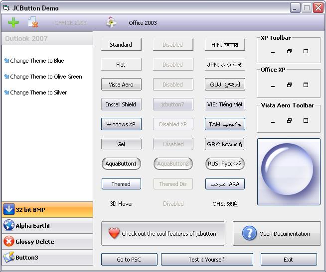



## jcButton v1\.7

### Description

UPDATE(16 Feb 2009). A button control with 14 styles, 32-bit Bitmap support, Checkbox/Optionbutton mode, Dropdown Menu support with Dropdown symbols/separators, Various effects like Picture Opacity, Lighten/Darken pictures on hover/down, Picture shadow, Caption Effects, etc. Rare/Uncommon button events aware. Unicode/RTL support. Fully optimized and flexible codes. System Hand Pointer, Balloon/Stabdard Tooltips. Color Scheme for all Visual styles. WindowsTheme style support for XP or above. All in a single file'd control. Updates. [28 Jan 2009] Fixed behavior of option button mode as suggested by Morgan Haueisen. [8 Feb 2009] Fixed "hovering problem brings front the Parent form" noted by K-Zero. [ 16 Feb 2009] Fixed Theme button issue, when theme is set to Windows Classic, the button was completely drawing black -- as noted by Zhu Jinyong. Thanks much for your support. Please leave your feedback :-)
 
### More Info
 

             |
---                |---
**Submitted On**   |2009-02-09 18:49:42
**By**             |[Juned Chhipa](https://github.com/Planet-Source-Code/PSCIndex/blob/master/ByAuthor/juned-chhipa.md)
**Level**          |Intermediate
**User Rating**    |4.9 (485 globes from 99 users)
**Compatibility**  |VB 6\.0
**Category**       |[OLE/ COM/ DCOM/ Active\-X](https://github.com/Planet-Source-Code/PSCIndex/blob/master/ByCategory/ole-com-dcom-active-x__1-29.md)
**World**          |[Visual Basic](https://github.com/Planet-Source-Code/PSCIndex/blob/master/ByWorld/visual-basic.md)
**Archive File**   |[jcButton\_v2144102162009\.zip](https://github.com/Planet-Source-Code/juned-chhipa-jcbutton-v1-7__1-71482/archive/master.zip)

